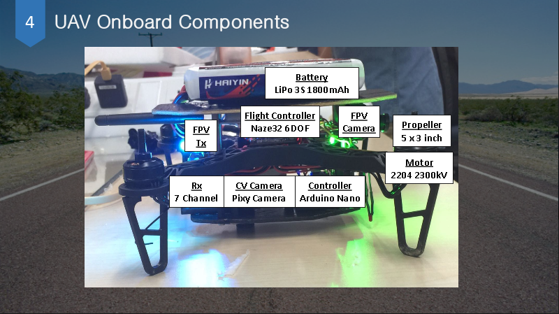
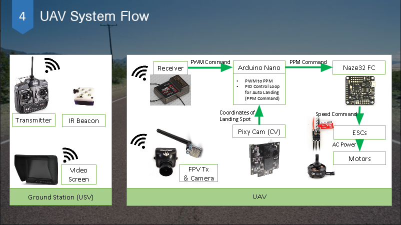
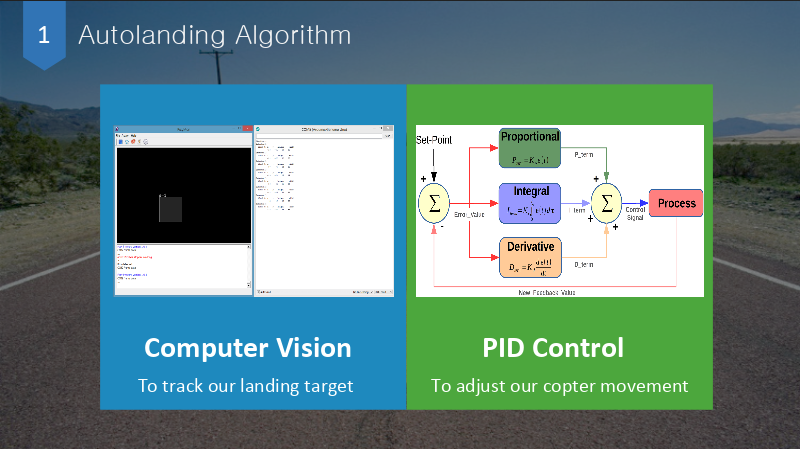
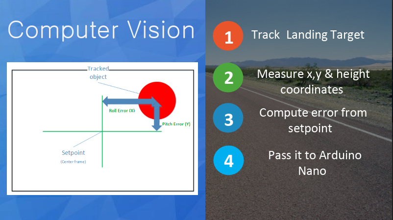
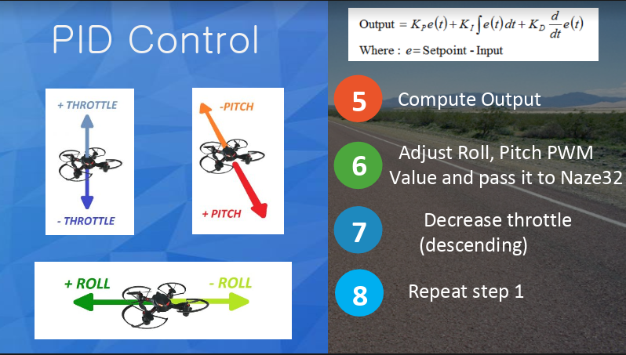

# Quadcopter Autonomous Landing (using Naze32 + Arduino Nano)
### [https://youtu.be/2tRe5EXvatU!](https://youtu.be/2tRe5EXvatU)

## About this project:
This project is mainly about coding our Arduino Nano to fulfill the collaborative mission between UAV (Unmanned Aerial Vehicle) and USV (Unmanned Surface Vehicle)

## Main Hardware Used (exclude the cables,motors,etc) :

- Naze32 ~ flight controller with Cleanflight firmware
- Turnigy 6x ~ radio controller
- Turnigy XR7000 ~ receiver
- Arduino Nano ~ as the brain of our quadcopter
- Pixy Camera ~ for our On-board object detector

## Programming Language : C with Arduino IDE
## What are we doing ? 

We are using Arduino as an intermediary between the radio controller and our quadcopter. 
Our quadcopter have two modes :
### 1. Autoland mode
When switch channel 5 is turned on, our copter will detect the landing platform by itself and hover to it as well as landing. Any external input from us (from radio controller) is ignored, except the yaw, channel 5 (autoland mode switch) and channel 6 (arm/disarm).

### 2. Manual mode
When switch channel 5 is turned off, our copter will be manually controlled by our radio controller.

# Disclaimer
This is an educational project developed many years ago and not meant to be developed further.

## Special Thanks to: Tee Chin Kiat and Dou Zi
